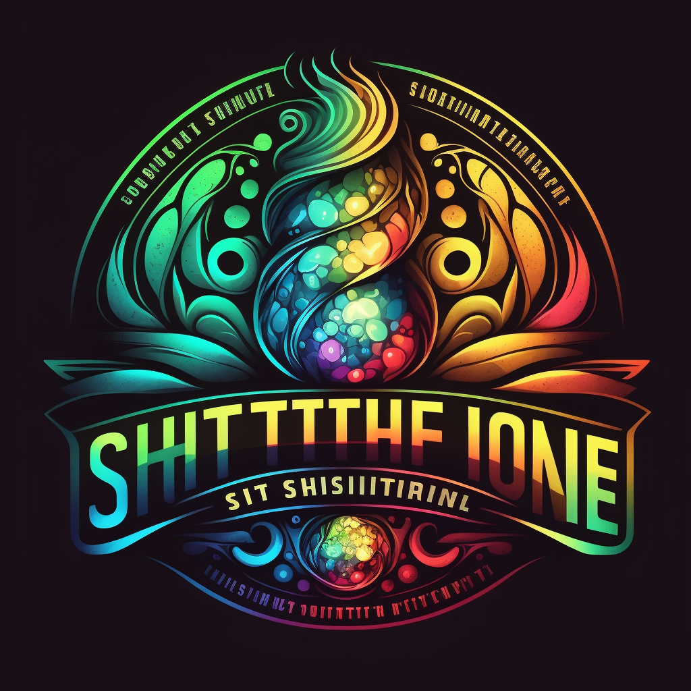

  
   

  <h3><b>YOUR-PROJECT-NAME-HERE</b></h3>

<!-- TABLE OF CONTENTS -->

# 📗 Table of Contents

- [📖 About the Project](#about-project)
  - [🛠 Built With](#built-with)
    - [Tech Stack](#tech-stack)
    - [Key Features](#key-features)
  - [🚀 Live Demo](#live-demo)
- [💻 Getting Started](#getting-started)
  - [Prerequisites](#prerequisites)
  - [Setup](#setup)
  - [Install](#install)
  - [Usage](#usage)
  - [Run tests](#run-tests)
- [👥 Authors](#authors)
- [🔭 Future Features](#future-features)
- [🤝 Contributing](#contributing)
- [⭐️ Show your support](#support)
- [🙏 Acknowledgements](#acknowledgements)
- [📝 License](#license)

<!-- PROJECT DESCRIPTION -->

# 📖 YOUR-PROJECT-NAME-HERE 

**YOUR-PROJECT-NAME-HERE** This is a capstone project that required me to distribute the layout with HTML, style it, and make it responsive for mobile and desktop with CSS. I also added menu functionality with JavaScript.

## 🛠 Built With 

### Tech Stack 

  
Client

  <ul>
    <li><a href="https://reactjs.org/">HTML</a></li>
    <li><a href="https://reactjs.org/">CSS (including responsive design)</a></li>
    <li><a href="https://reactjs.org/">JavaScript for menu functionality</a></li>
    <li><a href="https://webpack.js.org">Webpack</a></li>
  </ul>

Database

  <ul>
    <li><a href="https://www.postgresql.org/">PostgreSQL</a></li>
  </ul>

<!-- Features -->

### Key Features 

- **[Responsive design for mobile and desktop]**
- **[Menu functionality using JavaScript]**
- **[Use of modules and libraries]**

(<a href="#readme-top">back to top</a>)

<!-- LIVE DEMO -->

## 🚀 Live Demo 

- [Live Demo Link](https://estete9.github.io/IliArtes/)

(<a href="#readme-top">back to top</a>)

<!-- GETTING STARTED -->

## 💻 Getting Started 

To get a local copy up and running, follow these steps.

### Prerequisites

To run this project you need:

- VSCode
- npm
- Node

### Setup

Make sure you have VSCode, npm, and Node installed

### Install
In the root folder, run the script `npm install` to install all the libraries necessary.

### Usage
#### Webpack
- Run the scripts: `npm run watch-webpack` to only have Webpack watch your files or
- `npm run watch` to watch the tests and Webpack changes
#### Live Demo
- Run the script `npm run start` to see a live version of the project

### Run tests

Use the scripts: 
- `npm run watch-jest` to only watch your tests with Jest or 
- `npm run watch` to watch the tests and Webpack changes

(<a href="#readme-top">back to top</a>)

<!-- AUTHORS -->

## 👥 Authors 

👤 **Esteban Palacios**

- GitHub: [@Estete9](https://github.com/Estete9)
- Twitter: [@NaughTban](https://twitter.com/NaughTban)
- LinkedIn: [Esteban Palacios](https://www.linkedin.com/in/esteban-palacios-5030a772/)

(<a href="#readme-top">back to top</a>)

<!-- FUTURE FEATURES -->

## 🔭 Future Features 

- **Gallery popup**

(<a href="#readme-top">back to top</a>)

<!-- CONTRIBUTING -->

## 🤝 Contributing 

Contributions, issues, and feature requests are welcome!

Feel free to check the [issues page UPDATE URL HERE](https://github.com/Estete9/webpack-template/issues).

(<a href="#readme-top">back to top</a>)

<!-- SUPPORT -->

## ⭐️ Show your support 

If you like this project remember to star and share it 🥳️

(<a href="#readme-top">back to top</a>)

<!-- ACKNOWLEDGEMENTS -->

## 🙏 Acknowledgments 

- ACKNOWLEDGMENTS TO CREATIVE LICENSE AND OTHERS

<!-- LICENSE -->

## 📝 License 

This project is [MIT](./MIT.md)-licensed.

(<a href="#readme-top">back to top</a>)

